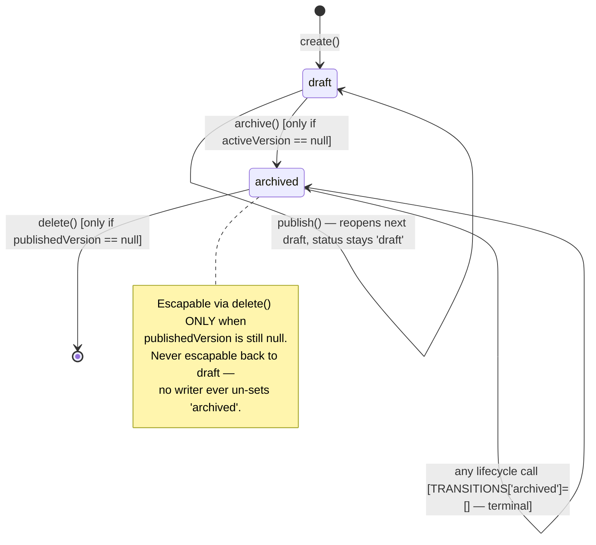
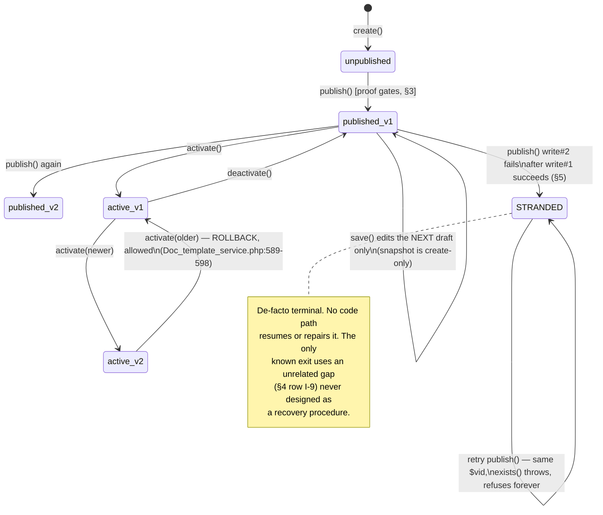

# 02 · State machine — Document Engine (Certificates)

**Agent: A6 · MODELLER. Evidence ceiling E2** (static source read; two counts below are E3,
explicitly marked) **for everything derived from code.** No runtime behaviour is claimed.
Classified `[CONFIRMED]` / `[INFERRED]` / `[UNKNOWN]` / `[CONTESTED]`.

**This file OVERWRITES a stale run-1 version.** Two of that version's findings (T1
"archive silently drops the only active template", T5 "no rollback exists") are now
**wrong** — both were fixed by a 2026-09-03 operator decision visible in the current code
(`Doc_template_service.php:589-598, 831-850`). Corrections are called out inline where they
recur below so nobody re-cites the old claims.

---

## 0 · The central complication, modelled as a tuple

`status` and publication are **orthogonal axes, not one lifecycle.** Every head document
is the tuple `(status, publishedVersion, activeVersion, version, lockVersion)`.

- `status ∈ {'draft','archived'}` on every writer that touches it
  (`Doc_template_service.php:225,556,853`) — `'published'` **is never written**
  `[CONFIRMED — E2 exhaustive write-trace + E3: 85/85 live docs, 0 with status='published']`.
- `publish()` calls `assertTransition($head['status'], 'published')`
  (`Doc_template_service.php:484`) — validating a transition **to a value the very next
  line never writes** (`:556` writes `'draft'`). `TRANSITIONS['published'] => ['archived']`
  (`:47`) is dead code: nothing can ever be in that state for `assertTransition` to be
  called against it a second time. `[CONFIRMED, CONTESTED against `firestore.rules:3164-
  3187`, which branches on `resource.data.status != 'published'` and comments "a PUBLISHED
  head is nearly frozen" — modelling a state the sole writer (the Admin SDK, which bypasses
  these rules entirely) never produces.]`
- The client independently **displays** a `'published'` status the server never persists:
  `designer.js:5257` sets `row.status="published"` on the in-memory gallery row right after
  a publish call succeeds, purely optimistically. A page reload re-fetches from
  `get_templates`, which can only ever return `'draft'` or `'archived'`
  (`Doc_templates.php:328-344`, no server-side status other than those two exists) — so the
  badge silently reverts with no explanation. `[CONFIRMED — new finding, not in prior
  passes]`

**What actually distinguishes a template is two independent nullable pointers on the same
document:** `publishedVersion` (highest frozen version) and `activeVersion` (what every
print point resolves, moved only by `activate()`/`deactivate()`). `status` only ever
answers "is this template editable and listed as live, or archived" — it says nothing about
publication.

---

## 1 · Mermaid — status axis and publication axis, drawn separately (they do not interact)

These two diagrams are independent because **no writer that moves `status` ever reads or
writes `publishedVersion`/`activeVersion`, and no writer that moves those ever touches
`status`** — traced exhaustively: `create()` (`:225`), `publish()` (`:556`) and `archive()`
(`:853`) are the only three writers of `status`; `save()`, `activate()`, `deactivate()` never
touch it (`[CONFIRMED]`, grepped `'status'` as an assignment target across the whole file).

---

## 2 · States the implementation can actually produce

| # | State (tuple shape) | Produced by | Citation | Live (E3) |
|---|---|---|---|---|
| S0 | `draft, pub=null, act=null, v=1` — fresh, unedited | `create()` | `Doc_template_service.php:210-243` | subset of 80 never-published drafts |
| S1 | `draft, pub=null, act=null, v=1+` — edited, never published | `save()` (repeatable) | `:314-349` | 80/85 templates, 94% (`_live-state.md` O5) |
| S2 | `draft, pub=N, act=null` — published, not (yet, or no longer) active | `publish()` fresh, **or** `deactivate()` of S3 | `:481-568`, `:740-768` | 3 of 5 `publishedVersion≠null` docs (5 total − 2 with `activeVersion≠null`) |
| S3 | `draft, pub=N, act=M (M≤N)` — published and active, draft running ahead | `activate()` | `:600-725` | 2/85 (`TPL0001` TC v6 active, head v7; `TPL0004` bonafide v1) — reproduced live at `_live-state.md` L7 (four distinct byte-hashes across v1/v4/v5/v6, confirming frozen content, not head content, renders) |
| S3b | `draft, pub=N, act=M<N` — rolled back to an older published version | `activate($id,$by,$version)` with `$version<published` | `:589-598,612-631,712-717`, logged distinctly `"Rolled back to v{N}"` | not observed live this pass — 0/2 active docs show `act<pub` |
| S5 | `archived, pub=null, act=null` — tidied away, never published | `archive()` from S0/S1 | `:826-862` | 2/85 have `status=archived`; whether either also had `pub≠null` before archiving is **[UNKNOWN — not captured live]** |
| S6 | `archived, pub=N, act=null` — a published-but-inactive template archived | `archive()` from S2 (guard only checks `activeVersion===null`, not `publishedVersion`) | `:826-850` | not distinguished from S5 in the live counts (see gap above) |
| STRANDED | `draft, pub=OLD-or-null, act=…, v=N (unchanged)` + an orphaned `documentTemplateVersions/{id}_v{N}` with no head pointer | `publish()` write #1 (`:551`) succeeds, write #2 (`:563`) never runs or fails | `:551,563,517-522` | not observed live — code-path shape only, `[CONFIRMED shape / INFERRED never hit]` |
| PHANTOM | `status='published'` | **no writer produces this** | `:225,556,853` write only `'draft'`/`'archived'`; nothing else assigns `status` | 0/85, and cannot occur under the current writer set |

**S0/S1 are the same tuple shape** (`pub=null,act=null`) and are distinguished only by
whether `save()` has ever run — not modelled as separate states by the code itself, listed
separately here only because the mission's evidence-gathering (`_live-state.md` O5) counts
them that way.

**S2 and S6's tuple shapes collide with a third path not listed above:** a template that
was published, activated, then deactivated (S3→S2) is field-for-field identical to one that
was published and never activated (S0/S1→S2 directly) — the tuple alone cannot distinguish
"was live and got pulled" from "never went live." Only the audit log (`log_audit()`,
`AUDIT_MODULE='DocTemplates'`) — not the document itself — records that history.
`[CONFIRMED, structural — the head schema simply doesn't carry a "previously active" flag]`

---

## 3 · Transition table — actor, capability grade, guard

| From → To | Trigger | RBAC grade | Guard(s) actually implemented | Citation |
|---|---|---|---|---|
| — → S0 | `create()` | edit | `schoolId`+`docType` non-empty; custom types require `docTitle`; id minted via unbounded-scan + create-only retry (TOCTOU, not a real CAS — `01b-backend-spec.md` §4) | `Doc_template_service.php:177-255` |
| S0/S1 → S1 | `save()` | edit | `status==='draft'`; `lockVersion` must match exactly (read-then-compare-then-write, not a Firestore precondition — `01c-data-spec.md` §7 atomicity table) | `:314-349` |
| S1 → S2 | `publish()` | **manage** | proof-on-record exists, `proof.version===head.version`, `proof.contentHash===contentHash(head)` (recomputed server-side, never trusted from the record); target version id must not already exist | `:481-568` |
| S2 → S3 | `activate()` (no explicit version = newest) | **manage** | `publishedVersion≠null`; atomic `commitBatch` with `precondition:{exists:true}` on the winner, nulls every other active sibling of the same `(schoolId,docType)` in the SAME commit; **refuses non-atomically** if no `commit` callable exists | `:600-725` |
| S3(v=N) → S3b(v=M<N) | `activate($id,$by,M)` | **manage** | `1≤M≤publishedVersion`; the frozen snapshot at `_v{M}` must `exists()`; logged distinctly as a rollback | `:589-598,612-631` |
| S3 → S2 | `deactivate()` | **manage** | `activeVersion≠null` (else refuse — "nothing to deactivate") | `:740-768` |
| S0/S1/S2 → S5/S6 | `archive()` | **manage** | `assertTransition(status,'archived')` — legal only from `draft`; **refuses if `activeVersion≠null`** ("archiving is tidying, not a decision to stop issuing" — 2026-09-03 fix, corrects the stale doc's T1) | `:826-862` |
| S0/S1/S5 → gone | `delete()` | **manage** | refuses if `activeVersion≠null` **or** `publishedVersion≠null`; **does not check `status` at all** — so an archived-but-never-published head (S5) is still deletable | `:786-820` |

**Every mutating endpoint is `_require_post()`-gated and capability-checked centrally by
`Doc_templates::_remap()` before any service method runs** (`01b-backend-spec.md` §1-2) —
not re-verified line-by-line here beyond spot-checking `publish`/`activate`/`archive`/
`delete` all carry `manage` in `CAPABILITIES` (`Doc_templates.php:44-73`), consistent with
what A4 reported. `[CONFIRMED]`

---

## 4 · Illegal transitions the implementation nevertheless permits

| # | Gap | Evidence | Severity note |
|---|---|---|---|
| **I-9** (new) | **`activate()` never checks `status`.** A template with `status='archived'` and `publishedVersion≠null` (state S6) CAN be `activate()`'d — the method's only guard is `publishedVersion≠null` (`Doc_template_service.php:604-609`); nothing rejects an archived head. Result: `status='archived'` **and** `activeVersion≠null` simultaneously — a document flagged "tidied away" while it is literally the template every print point for its `(school,docType)` resolves. No code path un-sets `status` afterward, so this hybrid state persists indefinitely once reached. | `Doc_template_service.php:600-609` (no status check anywhere in the method) | `[CONFIRMED, code trace; never observed live]`. Directly contradicts `archive()`'s own doc-comment intent ("archiving is tidying... nobody archives intending to disable issuance") — the mirror-image guard was added on the archive side (2026-09-03) but not the activate side. |
| **I-10** (new) | **`save()`'s strip-list omits `version`, not just `docType`.** The list stripped from every incoming patch is `['status','publishedVersion','activeVersion','templateId','schoolId','updatedBy','createdBy']` (`Doc_template_service.php:336-339`) — an **edit**-grade caller can PATCH the head's `version` counter directly via `save(docId,{version:N},lockVersion)`. This is the same "guard exists on paper but isn't wired into every path" pattern L9 found for `docType` (`_live-state.md` L9), on the field that `publish()`'s create-only snapshot-id derivation (`docId.'_v'.version`) depends on entirely. | `:336-339` vs. `:514` (`$vid = $docId.'_v'.$version`) | `[CONFIRMED — new finding, not in 01b/01c/live-state]`. Two consequences, opposite in valence: (a) setting `version` backward or to an already-published number causes the next `publish()`'s `exists()` guard to refuse — self-blocking, not corrupting; (b) setting it forward past the stuck value is the **only** known way to escape the STRANDED state (§5) — an undesigned, ungoverned recovery path, not a documented procedure. |
| **I-11** | **`docType` mutable post-creation via `save()`.** Already reported by A4/QA-LEAD (`01b-backend-spec.md` §6, `_live-state.md` L9, reproduced E4: an `edit`-grade caller minted `custom:qa_probe`, then `save()`'d `docType:"study"` — a Madhya-Pradesh school writing itself into the Andhra-Pradesh-only Study Certificate type) and reconfirmed here as the same strip-list class as I-10. `[CONFIRMED, E4-reproduced]` | `Doc_template_service.php:336-339`, `Doc_templates.php:606` (`_safe_type` never called from `save()`) | P2 today (bypasses a business rule within one's own tenant); becomes P1 the moment the print seam is wired (`CON-NO_PRINT_IMPL`). |
| **I-12** | **Archived templates are not removed from the gallery client-side**, despite the server's own refusal message promising "it disappears from the list." `hydrateFromServer` (`designer.js:5606-5621`) pushes **every** row returned by `get_templates` into `S.lib[type]` unconditionally — no `status` filter anywhere in that block. `libOf()` (`designer.js:1623`) returns `S.lib[id]` verbatim. `paintGallery()`'s `rows.forEach` (`designer.js:2580`) iterates the unfiltered array. `get_templates` itself (`Doc_templates.php:328-344`) issues no `status` predicate either — it returns every head for the school(+docType). | `Doc_templates.php:328-344`; `designer.js:5606-5621,1623,2580` | `[CONFIRMED — new finding]`. This compounds the already-known "published templates stuck forever" defect (`01c-data-spec.md` §10, `_live-state.md` L3): even a template that *was* successfully archived (via the console — no UI button reaches `archive` at all) does not disappear from what the user sees. |

---

## 5 · Transitions the business requires that the implementation cannot perform

| # | Missing / blocked transition | Consequence | Citation |
|---|---|---|---|
| **R-1 (given)** | **A published template cannot be removed from the gallery by any *user* action.** `delete()` correctly refuses once `publishedVersion≠null` (states this is "the record of what a certificate issued from it said") and names `archive()` as the remedy — but `archive`'s only client wrapper, `srv.archive` (`designer.js:1007`), has **zero call sites** anywhere else in the 5668-line file; no button/menu/keyboard path reaches it. QA-LEAD reproduced calling `srv.archive()` from the browser console and it worked (`_live-state.md` L3). **This is a UI-reachability gap, not a server-logic one** — the service method (`Doc_template_service.php:826-862`) is fully capable of transitioning S2→S6; nothing in `application/` prevents it. | Gallery grows monotonically for every ever-published template, forever, with no product-level control to stop it | `Doc_templates.php` route/capability table (`01b-backend-spec.md` §1); `designer.js` grep, zero hits outside definition |
| **R-2 (given)** | **A template stranded by a partially-failed `publish()` cannot publish that version or any later one** through the *designed* lifecycle. Retry recomputes the identical `$vid`, hits the `exists()` guard, and throws "already exists" before ever reaching write #2 again (`:517-522,551,563`). No endpoint resumes or repairs a stuck head. | Permanently blocked publish for that template via any designed path — see §4 I-10 for the one **undesigned** escape that happens to exist | `Doc_template_service.php:517-522,551,563`; `01b-backend-spec.md` §4, `01c-data-spec.md` §7 |
| R-3 | **No bulk cleanup for never-published drafts.** No "delete all drafts"/"bulk archive" endpoint exists among the 27 public methods on `Doc_templates.php`. 80/85 live documents are exactly this — largely written by a test harness against real tenant data (`_live-state.md` O5). | An unbounded, ever-growing gallery of throwaway drafts with no product-level remedy | `00-dependency-graph.md` §2 (endpoint inventory, exhaustive) |
| R-4 | **No way to revive an archived template.** `TRANSITIONS['archived'] = []` (`:48`) and no other writer ever sets `status` away from `'archived'` — confirmed by exhaustive grep of `'status'` as an assignment target in `Doc_template_service.php`. Recreating from scratch loses `version`/`lockVersion` history and mints a new document id. | An accidental archive of a still-wanted draft (S5, `publishedVersion=null`) is recoverable only by `delete()`-then-`create()`-from-nothing — no "undo" | `Doc_template_service.php:45-49` |
| R-5 | **No renumbering / no serial allocation.** Not this module's gap specifically — restated from `03-invariants.md` I13/I14 below because it is a required-but-absent transition class (issue a document, assign a reproducible serial) with zero implementation surface. | `CON-NO_PRINT_IMPL` — nothing issues from this build at all | `00-dependency-graph.md` §8, `01b-backend-spec.md` §9 |

**Correction to the stale doc:** the prior run-1 version listed **"T5 — roll back to an
earlier published version" as impossible.** It is not. `activate($docId,$by,$version)`
explicitly supports it (`Doc_template_service.php:589-598,612-631`), logs it distinctly as a
rollback, and the code's own doc-comment dates the decision 2026-09-03. **Do not re-cite the
old T5.**

---

## 6 · Terminal states and escapability

| State | Terminal? | Escape route | Citation |
|---|---|---|---|
| **archived, never published (S5)** | **No** — `delete()` only guards on `activeVersion`/`publishedVersion`, not `status`, so S5 is deletable outright. | `delete()` → gone (not reversible to draft, but not stuck either) | `Doc_template_service.php:786-820` (no `status` check) |
| **archived, published (S6)** | **Effectively yes for reactivation-as-draft** (no writer un-sets `status`), **but not for activation** — I-9 (§4) shows `activate()` can still be called on it, producing the hybrid `archived + active` state, which itself has no further exit either (nothing un-sets `status`, nothing re-deactivates a status it never checked). | none back to `draft`/`gallery-visible-as-live`; `delete()` refused (`publishedVersion≠null`) | `Doc_template_service.php:600-609,786-820` |
| **STRANDED (partial `publish()` failure)** | **De facto yes**, by design of the *intended* lifecycle — no endpoint resumes or repairs it. **Is it therefore a terminal state nobody designed?** Yes: nothing in `TRANSITIONS`, in `Doc_templates.php`'s 27 public methods, or in any test file names this state or offers a repair. The only way out found this pass (§4 I-10, `save()`'s unstripped `version` field) is a side effect of an unrelated omission, not a recovery feature — using it requires knowing the internal field name and the exact failure shape, which no UI surfaces. | `save(docId,{version:N+1},lockVersion)` — **undesigned, unverified whether it fully repairs the head vs. merely unblocks the next `publish()` call while leaving `publishedVersion` stale** | `Doc_template_service.php:336-339,517-522,551,563` |
| **Hybrid `archived + activeVersion≠null` (via I-9)** | Yes, in the sense that nothing built expects or exits this state | none found | `Doc_template_service.php:600-609` |

---

## 7 · Irreversible transitions, and which are unconfirmed in the UI

| Transition | Irreversible? | UI-confirmed reachable? |
|---|---|---|
| `publish()` (S1→S2) | **Yes** — the frozen `documentTemplateVersions/{id}_v{n}` is create-only at both the service layer (`exists()` refusal, `:517-522`) and the rules layer (`allow update, delete: if false`, `firestore.rules:3207-3215`, inert today since the panel uses the Admin SDK — `01c-data-spec.md` §8) | Yes — `srv.publish`, `designer.js:5295` |
| `archive()` (→S5/S6) | Irreversible as a `status` move (§6); **not** irreversible as a business decision, since a published archived template can be silently re-activated (I-9) | **No** — `srv.archive` has zero call sites (`00-dependency-graph.md` §2, `_live-state.md` L3). Only exercised via the browser console by QA-LEAD (E3). |
| `delete()` (→gone) | Yes, unconditionally (no soft-delete/undo found) | Yes — `srv.remove`, `designer.js:2714`; QA-LEAD reproduced deleting two never-published drafts live (`_live-state.md` L4) |
| `activate()`/rollback (S2↔S3↔S3b) | No — freely reversible between any two published versions of the same template | Yes — `designer.js:2758,5351,5448` |
| `deactivate()` (S3→S2) | No | Yes — `designer.js:2795`; reproduced live clearing `activeVersion` on two templates (`_live-state.md` L4) |

---

## Counts

| Item | Count | Evidence |
|---|---|---|
| Tuple-distinguishable states enumerated | 9 (S0/S1 merged in the tuple, S2/S6 share a shape reached two ways, STRANDED, PHANTOM) | E2 |
| States with a live example this pass | 5 (`S0/S1` combined 80/85, `S2` 3/85, `S3` 2/85, `S5`or`S6` 2/85 undifferentiated, `PHANTOM` 0/85) | E3, `_live-state.md` |
| Illegal-but-permitted transitions found | 4 (I-9 archive-then-activate hybrid; I-10 `version` unprotected in `save()`; I-11 `docType` unprotected in `save()`, E4-reproduced; I-12 archived rows never hidden client-side) | E2, 2 new this pass (I-9, I-10, I-12) |
| Business-required-but-impossible transitions found | 5 (R-1 given, R-2 given, R-3 bulk cleanup, R-4 revive-from-archive, R-5 issuance/serials) | E2 |
| Terminal states identified | 4 (S5-if-never-escaped, S6, STRANDED, the I-9 hybrid) | E2 |
| Of those, escapable at all | 1 fully (S5 via `delete()`), 1 by an undesigned side effect (STRANDED via I-10) | E2 |
| Corrections to the stale doc | 2 (T1 "archive silently drops active" — fixed 2026-09-03; T5 "no rollback" — false, rollback exists and is logged as such) | E2 |

## Named `[UNKNOWN]`s

- Whether either of the 2 live `status:archived` documents also carries `publishedVersion≠null`
  (distinguishing live S5 from S6) — not captured by `_live-state.md`'s population table.
- Whether the I-9 hybrid state (`archived` + `activeVersion≠null`) has ever actually occurred
  live — code-path only, not observed.
- Whether `save()`'s unstripped `version` field, used to bump past a STRANDED head, fully repairs
  the template (vs. leaving `publishedVersion` permanently stale relative to the orphaned
  snapshot) — not traced to a conclusion; flagged for a runtime-capable agent.
